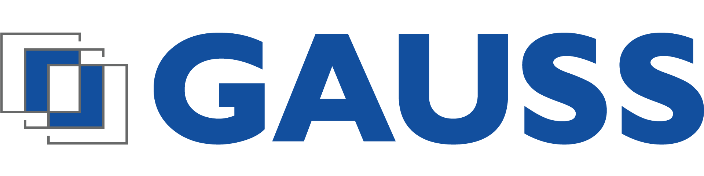

<div align="center">
  
  <h1>Urban Infrastructure Detector</h1>
  <p><strong>Next-Generation Spatial Intelligence & Computer Vision Platform</strong></p>

  
  
  
  
  
</div>

<br/>

The **Gauss Urban Infrastructure Detector** is an enterprise-grade spatial intelligence suite engineered to automatically detect, classify, and geographically anchor electrical distribution boxes (*firidas*) from high-speed panoramic mobile mapping surveys.

Built for precision engineering and large-scale utility cadastre, the platform completely automates the extraction of sub-centimeter 3D spatial data. By fusing state-of-the-art AI object detection with dense LiDAR point clouds, Gauss eliminates hundreds of hours of manual digitization, exporting directly into strict enterprise GIS workflows.

---

## I Enterprise Capabilities

*   **Sub-Centimeter Accuracy:** Translates 2D camera pixels into native 3D Stereo70 (EPSG:3844) spatial coordinates using an advanced LiDAR KDTree intersection algorithm.
*   **Intelligent Planar Fallback:** Guarantees zero data loss by seamlessly falling back to flat-earth trigonometric estimation if the LiDAR pulse is occluded.
*   **Automated Deduplication:** Cross-references detections across multiple overlapping camera feeds using highly optimized planar Euclidean clustering.
*   **Human-in-the-Loop Verification:** Includes a lightning-fast, modern Next.js console allowing operators to triage, verify, and attach metadata to AI predictions before final export.
*   **Turnkey GIS Integration:** Generates pure QGIS/ArcGIS-ready shapefiles (PointZ) enforcing rigid, 24-column utility cadastre schemas out of the box.

---

## II System Architecture

The suite operates on a decoupled, high-performance dual-stack architecture designed to handle massive volumes of panoramic Ladybug 5 survey data.

### III The Inference Engine (Python / FastAPI)
The heavy-lifting backend runs on a finely-tuned YOLOv8 neural network (`firida_detector_v4_verygood.pt`), orchestrated by a FastAPI cluster.
*   **Asynchronous Processing:** Spawns isolated, multi-threaded background workers to crunch gigabytes of imagery and telemetry without locking the main thread.
*   **Spatial Mathematics:** Handles complex unprojection math, dynamic Geoid undulation calibration, and LiDAR raycasting entirely in memory.
*   **Strict Metric Schema:** The engine never breaks projection. It calculates, clusters, and exports purely in metric Stereo70 coordinates, preserving the true physical elevation (Orthometric Z).

### IV The Verification Console (Next.js / React)
A stunning, responsive web dashboard built for speed and operational efficiency.
*   **Live Batch Telemetry:** Watch the AI engine tear through folders with real-time progress bars and terminal logs streamed directly to your browser.
*   **Dynamic Cartography:** Powered by `proj4` and `react-leaflet`, the dashboard re-projects the backend's strict metric payloads into WGS84 on-the-fly, providing beautiful, interactive OpenStreetMap visualizations.
*   **Triage Workflow:** A streamlined lightbox gallery lets operators hit the spacebar to instantly verify targets, attach house numbers (`Nr. Imobil`), and soft-delete anomalies.

---

## V Technical Deep Dives

Curious about the math behind the magic? Review our internal architecture documentation:

*   [**The 3D LiDAR Raycasting Engine**](docs/technical/01_lidar_3d_raycasting.md) — *Learn how we unproject camera pixels, calibrate the Geoid offset dynamically, and strike targets inside a KDTree.*
*   [**Planar Fallback Geometry**](docs/technical/02_planar_fallback_geometry.md) — *Discover our fail-safe trigonometric approach for handling occluded LiDAR targets.*

---

## VI Deployment Guide

Getting the platform running on a new workstation is highly streamlined. 

### 1. Boot the Inference Engine
We isolate the Python backend in a virtual environment to ensure zero conflicts with existing system libraries.

```bash
# Clone the repository
git clone https://github.com/MandaFlavian-Alexandru/Gauss-Urban_Infrastructure_Detector.git
cd Gauss-Urban_Infrastructure_Detector

# Create and activate a secure virtual environment
python -m venv .venv
.\.venv\Scripts\activate   # On Linux/Mac: source .venv/bin/activate

# Install the AI and geospatial dependencies
pip install -r requirements.txt

# Launch the FastAPI cluster
uvicorn Gauss_API:app --host 0.0.0.0 --port 8000 --reload
```

### 2. Launch the Verification Console
Open a **new terminal window** and leave the Python engine running in the background.

```bash
cd frontend

# Install the Next.js UI packages (including Leaflet and Proj4)
npm install

# Start the interactive dashboard
npm run dev
```

Finally, open your browser and navigate to `http://localhost:3000` to access the Gauss command center.

---
<div align="center">
  <i>Engineered by Gauss for superior urban intelligence.</i>
</div>
